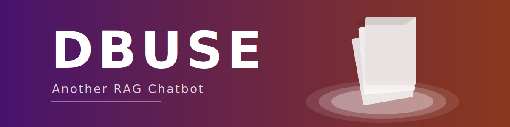

<div align="center">
  
</div>

# Document Base Unified Search and Extraction (DBUSE)

A lightweight Retrieval-Augmented Generation (RAG) chatbot for processing and querying Word documents, Excel files, and PDFs using Python 3.9, OpenAI API, LangChain, and Chroma.

* Pronunciation: "DEH-byew-see"
* Alternative: "The Bus"

## Features

- **Multiple Document Formats**: Processes PDF, Word, and Excel files
- **Persistent Document Bases**: Save and manage multiple document collections
- **Conversation History**: Supports contextual follow-up questions
- **Citation Support**: Answers include citations to source documents
- **Streamlit UI**: Clean interface for document upload and chatting

## Installation

1. Clone this repository:

   ```bash
   git clone https://github.com/yourusername/dbuse.git
   cd dbuse
   ```

2. Create and activate a conda environment:

   ```bash
   conda env create -f environment.yml
   conda activate rag_chatbot
   ```

3. Set up your OpenAI API key:

   ```bash
   export OPENAI_API_KEY="your-openai-api-key"
   ```

## Usage

### Streamlit App

```bash
python run_app.py
```

Or directly:

```bash
streamlit run app.py
```

### Python API

```python
from rag_chatbot import RAGChatbot

# Initialize the chatbot
chatbot = RAGChatbot(openai_api_key="your-api-key")

# Load documents
chatbot.load_documents(file_paths=["document.pdf", "spreadsheet.xlsx"])

# Ask questions
answer = chatbot.ask("What information is in these documents?")
print(answer)
```

## Project Structure

```
dbuse/
├── utils/
│   ├── document_processor.py  # Document text extraction
│   ├── vector_store.py        # ChromaDB embeddings manager
│   ├── document_base_manager.py # Persistent document bases
│   └── prompt_loader.py       # YAML prompt templates
├── prompts/
│   ├── query_rewriter.yaml    # Rewrite contextual questions
│   └── qa_system.yaml         # Q&A with citations
├── diagrams/                  # Mermaid diagrams
├── test/                      # Test scripts
├── app.py                     # Streamlit UI
├── rag_chatbot.py             # Core RAG implementation
├── run_app.py                 # App launcher
├── demo-notebook.ipynb        # Demo notebook
└── environment.yml            # Dependencies
```

## Future Improvements

Potential enhancements for future versions:

* Support for more document formats (e.g., HTML, Markdown, CSV, TXT)
* Support for OCR, captioning for images and images within documents
* Support for ipynb tutorials
* Integration with additional language models beyond OpenAI, like Claude
  * Claude DBUSE has a nice ring to it
* Improved handling of tables and structured data from Excel files

## License

This project is licensed under the MIT License - see the LICENSE file for details.

## Acknowledgments

This project leverages several powerful open-source libraries:

* [LangChain](https://github.com/langchain-ai/langchain) for document processing and RAG pipeline
* [Chroma](https://github.com/chroma-core/chroma) for vector database functionality
* [Streamlit](https://github.com/streamlit/streamlit) for the user interface
* [OpenAI](https://github.com/openai/openai-python) for language models and embeddings

## Contact

For questions or feedback, please open an issue on the GitHub repository or contact the project maintainer.
