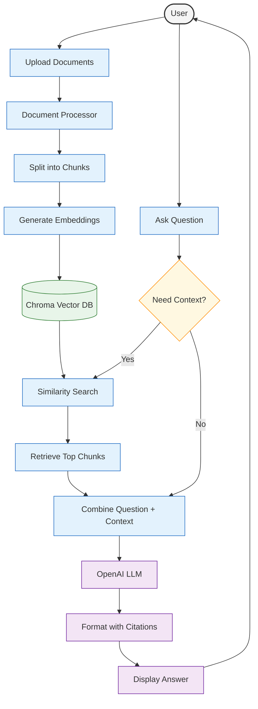

# DBUSE User Flow Diagram 

```mermaid 
flowchart TD
    User([User]) --> Upload[Upload Documents]
    Upload --> Process[Document Processor]
    Process --> Split[Split into Chunks]
    Split --> Embed[Generate Embeddings]
    Embed --> VectorDB[(Chroma Vector DB)]
    
    User --> Question[Ask Question]
    Question --> Context{Need Context?}
    Context -->|Yes| Search[Similarity Search]
    VectorDB --> Search
    Search --> Retrieve[Retrieve Top Chunks]
    Retrieve --> Combine[Combine Question + Context]
    Context -->|No| Combine
    
    Combine --> LLM[OpenAI LLM]
    LLM --> Format[Format with Citations]
    Format --> Display[Display Answer]
    Display --> User
    
    classDef userNode fill:#f5f5f5,stroke:#333,stroke-width:2px;
    classDef processNode fill:#e3f2fd,stroke:#1565c0,stroke-width:1px;
    classDef storageNode fill:#e8f5e9,stroke:#2e7d32,stroke-width:1px;
    classDef decisionNode fill:#fff8e1,stroke:#ff8f00,stroke-width:1px;
    classDef outputNode fill:#f3e5f5,stroke:#6a1b9a,stroke-width:1px;
    
    class User userNode;
    class Upload,Process,Split,Embed,Question,Search,Retrieve,Combine processNode;
    class VectorDB storageNode;
    class Context decisionNode;
    class LLM,Format,Display outputNode;
```
