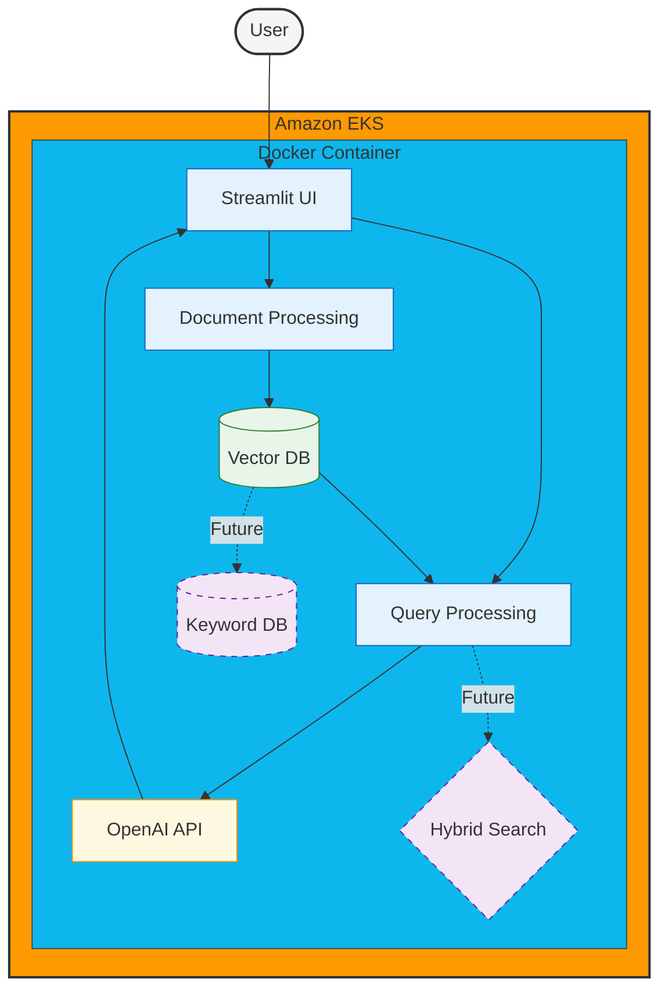

# DBUSE USER FLOW CLOUD

```mermaid
flowchart TB
    User([User]) --> StreamlitUI[Streamlit UI]
    
    subgraph EKS["Amazon EKS"]
        subgraph Docker["Docker Container"]
            StreamlitUI --> DocProcess[Document Processing]
            DocProcess --> VectorDB[(Vector DB)]
            
            StreamlitUI --> QueryProcess[Query Processing]
            VectorDB --> QueryProcess
            QueryProcess --> OpenAI[OpenAI API]
            OpenAI --> StreamlitUI
            
            VectorDB -.-> |Future| KeywordDB[(Keyword DB)]
            QueryProcess -.-> |Future| HybridSearch{Hybrid Search}
        end
    end
    
    classDef userNode fill:#f5f5f5,stroke:#333,stroke-width:2px;
    classDef eksNode fill:#FF9900,stroke:#232F3E,stroke-width:2px;
    classDef dockerNode fill:#0DB7ED,stroke:#384d54,stroke-width:1px;
    classDef componentNode fill:#e3f2fd,stroke:#1565c0,stroke-width:1px;
    classDef dbNode fill:#e8f5e9,stroke:#2e7d32,stroke-width:1px;
    classDef apiNode fill:#fff8e1,stroke:#ff8f00,stroke-width:1px;
    classDef futureNode fill:#f3e5f5,stroke:#6a1b9a,stroke-width:1px,stroke-dasharray: 5 5;
    
    class User userNode;
    class EKS eksNode;
    class Docker dockerNode;
    class StreamlitUI,DocProcess,QueryProcess componentNode;
    class VectorDB,KeywordDB dbNode;
    class OpenAI apiNode;
    class KeywordDB,HybridSearch futureNode;
```
