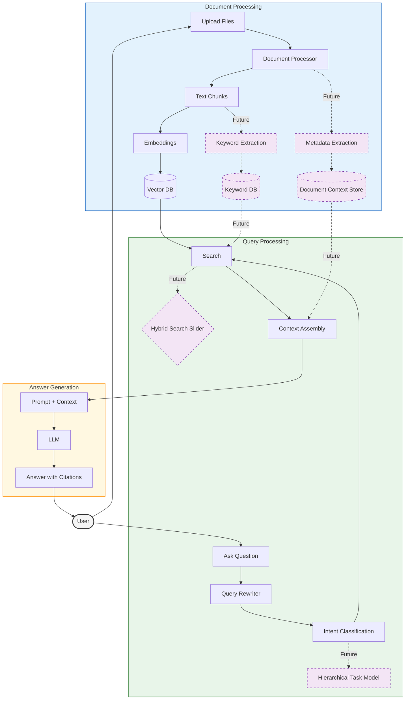

# DBUSE User Future Flow

```mermaid
flowchart TB
    subgraph Document["Document Processing"]
        Upload[Upload Files] --> Process[Document Processor]
        Process --> Split[Text Chunks]
        Process -.-> |Future| MetaExtract[Metadata Extraction]
        Split --> Embed[Embeddings]
        Split -.-> |Future| KeyExtract[Keyword Extraction]
        Embed --> VectorDB[(Vector DB)]
        KeyExtract -.-> KeyDB[(Keyword DB)]
        MetaExtract -.-> MetaStore[(Document Context Store)]
    end
    
    subgraph Query["Query Processing"]
        Ask[Ask Question] --> Rewrite[Query Rewriter]
        Rewrite --> IntentClass[Intent Classification]
        IntentClass -.-> |Future| TaskModel[Hierarchical Task Model]
        IntentClass --> Search[Search]
        VectorDB --> Search
        KeyDB -.-> |Future| Search
        Search -.-> |Future| HybridSearch{Hybrid Search Slider}
        Search --> Context[Context Assembly]
        MetaStore -.-> |Future| Context
    end
    
    subgraph Generation["Answer Generation"]
        Context --> Prompt[Prompt + Context]
        Prompt --> LLM[LLM]
        LLM --> Answer[Answer with Citations]
    end
    
    User([User]) --> Upload
    User --> Ask
    Answer --> User
    
    classDef userNode fill:#f5f5f5,stroke:#333,stroke-width:2px;
    classDef docNode fill:#e3f2fd,stroke:#1565c0,stroke-width:1px;
    classDef queryNode fill:#e8f5e9,stroke:#2e7d32,stroke-width:1px;
    classDef genNode fill:#fff8e1,stroke:#ff8f00,stroke-width:1px;
    classDef futureNode fill:#f3e5f5,stroke:#6a1b9a,stroke-width:1px,stroke-dasharray: 5 5;
    
    class User userNode;
    class Document docNode;
    class Query queryNode;
    class Generation genNode;
    class MetaExtract,KeyExtract,KeyDB,MetaStore,TaskModel,HybridSearch futureNode;
```
